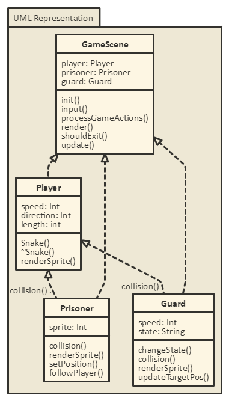

# Recreating Snake
## The concept
Snake is a timeless classic, you know what else is a timeless classic? Metal gear solid
 And the name of the main character in metal gear? Solid Snake

Aaaaand that's about as far as this idea goes; I've been tasked with recreating snake in Huxtables Awesome Sauce game engine
with a few conditions, The game has to work (Obviously) and it needs to be significantly modified. So I have personally tasked myself with turning snake into a stealth based spy espionage game. Shouldn't be too hard... right?  _famous last words_

## Developing the idea
So the idea is that you play a normal game of snake where each dot is a prisoner of war.
A set amount of prisoners are required per mission and once collected you can exit through the escape route or continue
rescuing more prisoners for bigger score. As you play obviously your snake gets longer, making you easier to spot by the
patrolling eagles which will proceed to eat you once spotted. 

## Level design
Each level will consist of a number of large rooms for the player to navigate through with a series of choke points connecting each room
to serve as a position where guards can easily catch player out if the're not careful. This should cause the player to experience claustrophobia
when transitioning between rooms as the margin for error will be small. The prisoners will spawn in locations that are easy to get to, 
but hard to navigate out of if the player is being chased, this will discourage the snake creating a train of guards behind them as they play and encourage tactical, thoughtful play. 

## Structure
Structuring the game should go as follows: 
Class for the snake 
This will hold info about how long the snake is
as well as all the functions for player movment

Class for the prisoners 
This will contain the function for following the player
as well as which number in the chain they are

Class for the Eagles 
This will contain the info about how fast the guard is and what state they are in
as well as the functions for swaping state and what to do each update.

Class for the game co-ordinator 
This will hold overall information about the game as well as functions for key events such as spawnng prisoners

<figure>
	
	<figcaption>A simple uml diagram of the game, subject to change.</figcaption>
</figure>

