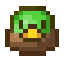
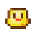

# Late and tardy
So this post is a week late with good explanation, i messed up.

In my last post I overconfidently stated that it should take me only a week to mock up a simple snake game, needless to say that didn't happen à la missing post. <br>
On the good side, this means I can share some code. On the bad side, i'm almost 2 weeks beind schedule so I've decided to dithch the stealth game idea and make some more minor adjustments to my snake game.

## Broken trails
Turns out getting the snake sements to follow each other was harder than I had anticipated. <br>
My psuedo code looked a little like this
```c++
targetPosition = snakeHead.position;
updateSnakeHead(); //Function to move the player
for (int x = 0; x < player.length; x++)
{
    lastPosition = snakeBody[x].position;
    snakeBody[x].position = targetPosition;
    targetPosition = lastPosition;
}
```
Seems simple enough, in a dry run it should go something like this:

_lets say the snake position is [1,1] and all 3 boddies are to the left. B for body, H for head, - for target_ -> B B B H <br>
[1] targetPosition = snakeBody[x].position [1,1] <br>
[2] updateSnakeHead() moves the snake head to [2,1] -> B B B - H <br>
[3] -enter the for loop- <br>
[4] lastPosition = snakeBody[0].position [0,1] <br>
[5] snakeBody[0].position = targetPosition [1,1] -> B B - B H <br>
[6] targetPosition = lastPosition [0,1] <br>
[4] lastPosition = snakeBody[1].position [-1,1] <br>
[5] snakeBody[1].position = targetPosition [0,1] -> B - B B H <br>
[6] targetPosition = lastPosition [-1,1] <br>
[4] lastPosition = snakeBody[2].position [-2,1] <br>
[5] snakeBody[1].position = targetPosition [-1,1] -> - B B B H <br>
[6] targetPosition = lastPosition [-2,1] <br>
[7] -exit for loop- <br>

However apparently not, I'm probably just being dumb, but this code just wouldn't work. So after many hours I found a new method, it uses more memory due to storing more variables however it actually work so atleast theres that.

## What now then?
Now that he core game is done I have just over a week left, not a lot. So i'm ditching the stealth game idea and taking a more simple approach.

Im going to chane my snake into a trail of ducklings, with the head acting as mother duck. Theme aside the player will have a small goal in wich they can deposit their ducklings for bonus points, the more ducklings they deposit at once the higher the score. This will add a risk/reward factor into the game as the player wil move faster each duckling they pickup, increasing the difficulty but also increasing the reward<br>

 	

Ofcourse with these changes I'll need to add 2 new objects to the game, warranting a change in the original UML I posted as well as some new psuedo code, but thats just how these things work and I can already feel the crunch intensifying. 

I'm not even gonna jinks it this time around, this idea will be simple enough to polish off by the end of the week, including a full scoreboard and a simple options menu (for adjusting the difficulty, snake speed etc.) The hand in is thursday next week so I'll update again on saturday and then after I've recived feedback.

