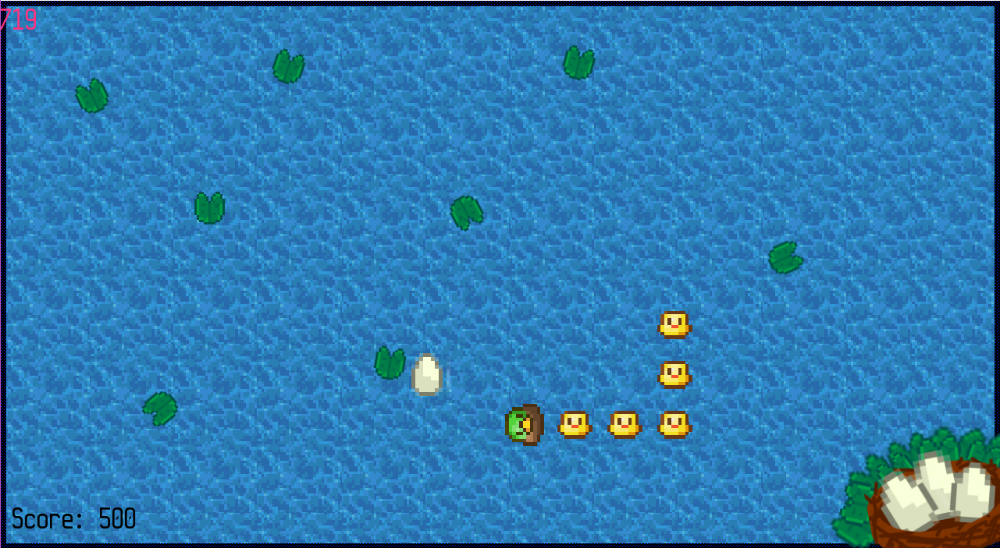

# Duck duck evolution
Snake but with ducks!

In this new take of an old classic, players must rescuing eggs that have fallen from their nest into the pond, with each egg they rescue the faster they get. Players may chose to tap out at any time by delivering the eggs back to the nest, the more eggs a player delivers the more they'll slow down and the greater the score they will gain.

This project was coded in c++. The source code for this project can be found [Here (github)](https://github.com/JohnnersUK/Duck-duck-evolution) and can be compiled in visual studio 2017 with the Windows SDK 10.0.16299.0. 

Development posts for this game can be found on this portfolio under the tag duck duck evolution.