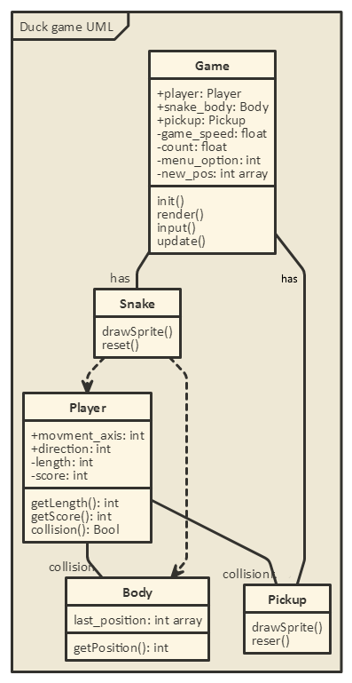

# Final progress report
Here it is, the last stretch until submission.
This post is just mainly housekeeping so I’ll keep it brief.
## Recap of the final idea
So my game idea was to turn snake into a game about rescuing ducklings. The player (Acting as mother/Father duck) is tasked with saving the eggs that have fallen down stream and returning them to the duck pond. The duck speeds up with each duckling in trail and colliding with the ducklings or walls causes a game over. The more ducklings the player saves in one go, the more points they get.
##New UML
As you should be aware if you've been following these posts, I ran into some difficulties and had to change my game idea last minute, with those changes came this new UML diagram
_tadaaa_

 

As you can see I have stripped out the guard class but kept the rest pretty much the same, the duck pond mechanic falls under the collision function in the player as it didn't need to be a class of its own fortunately.

It's pretty easy to follow, the snake class has 2 children for the head and the body, the body just follows the head and the head connects to the pickup class via their Collison functions
This all links to a master game class which handles all the rendering, game inputs etc.
## Closing thoughts
This project didn't go as smoothly as I hoped and there are a few mechanics I wish to change.
I wanted to have the pickups moving across the screen slowly, but I found that this didn't really work as it A) made the game impossible in certain scenarios (The egg would frequently travel over the player body and B) just wasn't that fun
I would also have liked to add another obstacle for the player to avoid because as it stands the game can last indefinably if the player only collects one egg at a time.
My code structure is good as far as I can tell and the game is well implemented, with no known bugs, however I might add that next time I would use a vector for the duck body, it's just we were advised not to as the lecturer had not covered them yet.

#Marking
So turns out duck game went down a treat! Coding wasn't as strong as overall gameplay experience however I can only improve from here
To improve:
- Object orientation
- Memory managment

