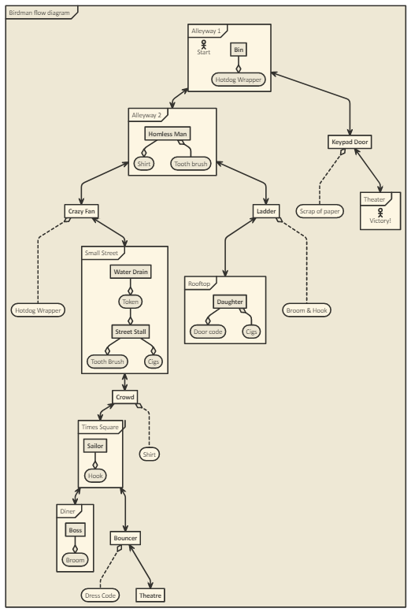
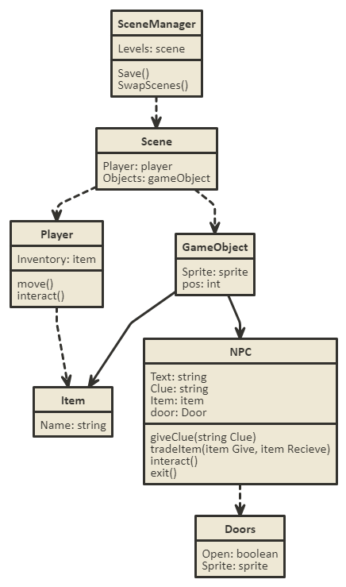

# Birdman
It is time, once again, to develop another game, this time based off of the Oscar winning film Birdman. 
 Birdman as a film is brilliant, it has many themes throughout the movie such as the egocentric world we live in, drug addiction, mental health and wellbeing, and presents viewers with questions we've all thought but don't really know the answer to; Who are we really? Do we matter? Would anyone care if I die? Would anything even change? 
 The film never answers these question but instead leaves the audience with a very thought provoking climax, that is if you even get the film in the first place.

## Game time
 With all that aside, a few class mates and I wanted to make a game based off one scene in particular. The scene where birdman gets locked outside.

 Whilst a pivotal scene in the film, which points out how dependant Michael Keaton is on the bridman, we wanted to detach ourselves from the franchise and focus on the premise of being locked out with little time before your big show.

 Naturally this blends well with the puzzle genre because if finding a way back in was a simple as walking around front like in the film there wouldn't be much of a game at all. The game will also be Point and click styled as we feel it is the easiest type of game to access, you just point and click.

## Game flow
 To show the flow of the game and the paths the player can take we made a mock up diagram to show how, so far, the player can beat the game; 
 
## UML
 Along with a simple UML diagram;  
 
