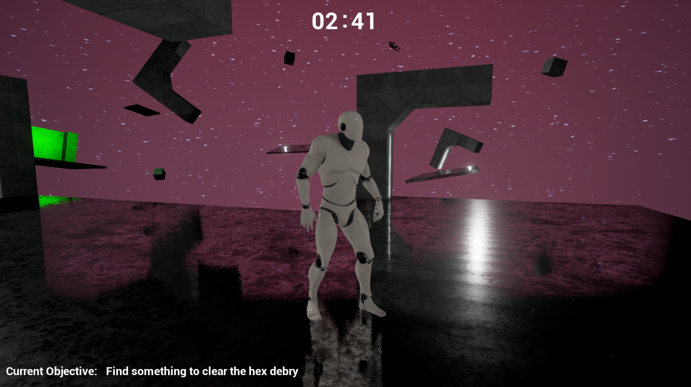

# Space place
Space place is a short set piece of an puzzle platformer set on an abandoned space ship. Taking inspiration from alien, dead space and classic zelda titles, users awake to find their ship void of life and near self-destruct.

Space place was designed as a part of my Game design course and focused mainly on the level design, below you can find mock-ups for each section:

 ../assets/img/spacemap1.png ../assets/img/spacemap2.png ../assets/img/spacemap3.png ../assets/img/spacemap4.png ../assets/img/spacemap5.png  

Updates about the development of this project can be found in the blog section of this portfolio under the category space place.
