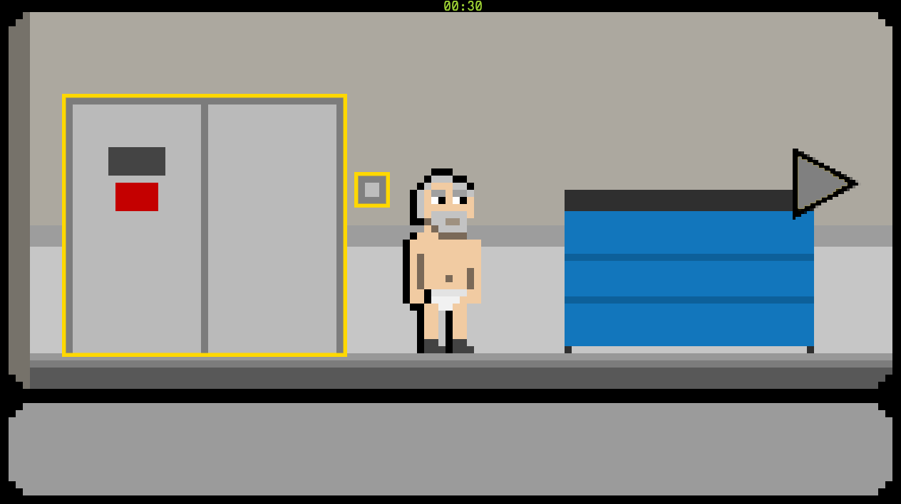

# Birdman's break-in
**Based off of the academy award winning film Birdman.
Comes a game 3 students made in 4 weeks.**  

**Play as birdman, a down on his luck actor looking for his next break of fame.
Use your wit and problem-solving skills to out run your past and make it back in time for the big show!**

All cheesiness aside, Birdman's break-in is a point and click adventure based off of the famous lockout scene.
This project was made by myself and 2 other team mates over the span of 4 weeks.

Birdman's break in features;
- Time trial puzzles
- Data driven encounters
- Item combination and trading
And much more!

Posts covering the development of this project can be found in the blog section of this portfolio under the "Birdman's break-in" tag

This project was coded in c++. The source code for this project can be found [Here (github)](https://github.com/JohnnersUK/birdmans-break-in) and can be compiled in visual studio 2017 with the Windows SDK 10.0.16299.0.

So far, this game is a 30 second set piece showcasing the scene management and data driven systems behind the scenes, expansion into a full game is unlikely.

_This game has no affiliation with birdman or Alejandro González Iñárritu, it's just a silly uni project_
